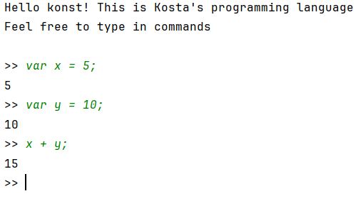
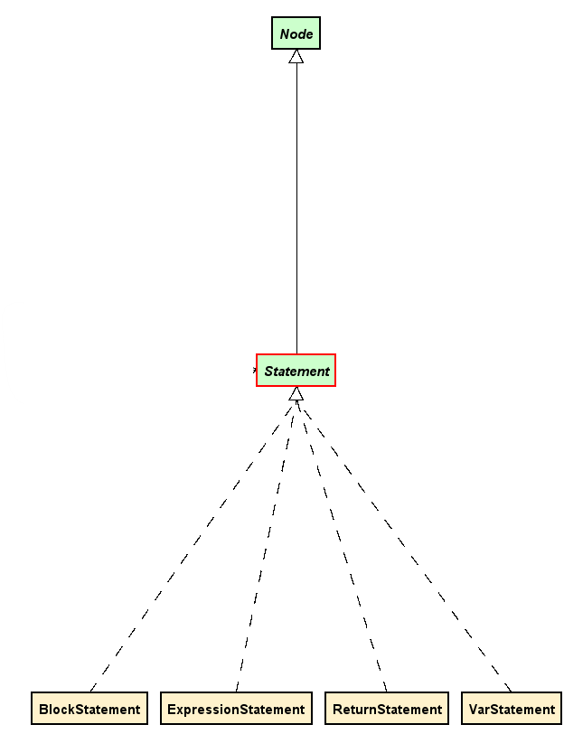
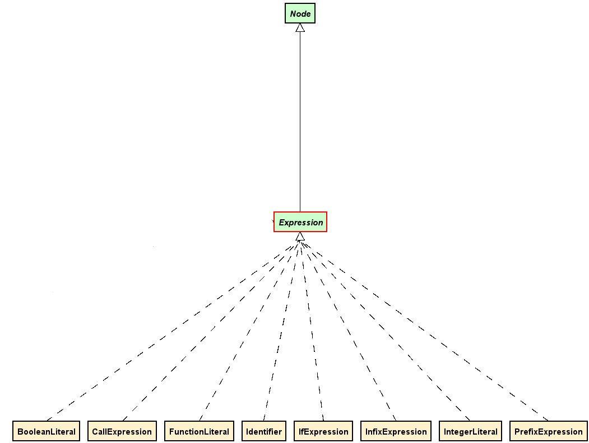

# Table of Contents
1. [Introduction](#introduction)
2. [Overview](#overview)
3. [Setup and installation](#setup-and-installation)
4. [Kosta-language](#kosta-language)
   - [Variables and Data types](#1-variables-and-data-types)
   - [Expressions and Operators](#2-expressions-and-operators)
   - [Functions](#3-functions)
   - [Control Flow](#4-control-flow)
   - [Arrays and Hashmaps](#5-arrays-and-hashmaps)
   - [Scopes and Closures](#6-scopes-and-closures)
   - [Function Literals and Immediate Invocation](#7-function-literals-and-immediate-invocation)
5. [Code structure](#code-structure)
   - [repl](#repl)
   - [Lexer](#lexer)
   - [Parser](#parser)
   - [AST (Abstract Syntax Tree)](#ast-abstract-syntax-tree)
   - [Environment](#environment)
   - [Evaluator](#evaluator)
6. [References](#references)

---

## Introduction
This project is a Java implementation of a Monkey-like interpreter, inspired by [Writing An Interpreter In Go](https://interpreterbook.com/). This interpreter supports variable bindings, integers, booleans, characters(*coming soon*), arrays(*coming soon*), hash structures (*coming soon*), arithmetic and boolean operations like +, -, *, /, &, |, built-in functions(*coming soon*), first-class and higher order functions, closures.

---

## Overview


---

## Setup and installation
see [CONTRIBUTING.md](CONTRIBUTING.md)

---

## Kosta-language

#### 1. **Variables and Data types:**
* *Null*: A special value representing nothing.
* *Integers*: Whole numbers.
* *Booleans*: true or false.
* *Arrays*: Ordered collections of values.
* *Hashmaps*: Key-value pairs for storing structured data.

```javascript
var n = null; // Null value
var integer = 1; // Integer
var boolean = false; // Boolean
var array = [1, 2, 3, 4, 5]; // Array
var hashmap = { 'a': 1, 'b': false, 'c': 'd', 'e': [1, 2] }; // Hashmap
```

#### 2. **Expressions and Operators**
- *Arithmetic Operators*: `+`, `-`, `*`, `/`
- *Comparison Operators*: `==`, `!=`, `>`, `<`
- *Logical Operators*: `&` (AND), `|` (OR), `!` (NOT)
- *Prefix Operators*: `-` (negation), `!` (logical NOT)
- *Grouping*: Use parentheses `()` to influence evaluation order.

```javascript
var arithmeticExpression = 10 * (20 / 2); // Evaluates to 100
var logicalExpression = !true & false | true != 5 > 7 - 1; // Evaluates to true
var mixedArithmeticComparison = 5 + 1 * 2 - 3 / 1 == 30; // Evaluates to false
var negativePrefix = -5; // Prefix operator
var notTruePrefix = !true; // Prefix operator
var complexComparison = (5 > 7 == 5 < 7) != false; // Grouping and comparison
```

#### 3. **Functions**
_Functions are first-class citizens in the language. They can_:
- Be defined using the `fn` keyword.
- Accept parameters and return values.
- Support recursion and higher-order functions.
- Be passed as arguments or returned from other functions.

```javascript
var add = fn(a, b) { return a + b; }; // Function definition
add(1, 2); // Function call

var factorial = fn(n) { // Recursive function
  if (n == 0) { 1; } 
  else { n * factorial(n - 1); }
};

var higherOrderFunction = fn(f, x) { return f(f(x)); }; // Higher-order function
var invert = fn(b) { !b; };
higherOrderFunction(invert, true); // Evaluates to true
```

#### 4. **Control Flow**
_Language supports conditional expressions using `if-else`. These expressions can be used anywhere a value is expected_.

```javascript
var ifExpression = if (!a == b) { true; } else { false; }; // If-else expression
var onlyIfExpression = if (true) { false; }; // Only if expression is also valid
```

#### 5. **Arrays and Hashmaps**
_Arrays and hashmaps, with the ability to access and modify elements using dot notation_.

```javascript
var array = [1, 2, 3, 4, 5];
var firstElement = array.0; // Accessing array elements
array.1 = 4; // Replace 2 with 4 in array


var hashmap = { 'a': 1, 'b': false, 'c': 'd', 'e': [1, 2] };
var valueA = hashmap.'a'; // Accessing hashmap elements
hashmap.'a' = 'b'; // Update 'a'
hashmap.'h' = 5; // Put new key value pair
```

#### 6. **Scopes and Closures**
_Language supports lexical scoping, meaning functions capture variables from their surrounding environment_.

```javascript
var i = 5;
var iSeeYou = fn() { return i + 1; }; // Captures 'i' from outer scope

var outerFunction = fn() { 
  var a = true; 
  return fn() { a | b; }; // Captures 'a' from outer scope
};
```

#### 7. **Function Literals and Immediate Invocation**
_Functions can be defined and invoked immediately which are called function literals_.

```javascript
fn(a, b) { a + b; }(1, 3) + 6; // Evaluates to 10
fn(x) { return factorial(x); }(3); // Evaluates to 6
```

---

## Code structure

### Repl
[Repl](https://en.wikipedia.org/wiki/Read%E2%80%93eval%E2%80%93print_loop) stands for 'Read-eval-print-loop' which simply is an interactive programming environment that:
1. Reads user input
2. Evaluates code
3. Prints the result 
4. And repeats

For this time this is the only implementation provided for the main interface for users to interact with the interpreter. String is displayed in the java's standard output stream indicating program being ready to read the user input. Repl contains one ```start()``` method that runs it with specified input and output streams.

> **_NOTE:_** There are two special methods: exit() and tree() which we can pass through the terminal. exit() - stops the loop and tree() prints the formatted AST (abstract syntax tree) of the program. For example ```tree() var x = 54;```

### Lexer

[Lexer](https://en.wikipedia.org/wiki/Lexical_analysis) transforms raw source code into a sequence of tokens that can be processed by the __parser__. It's first stage in interpreter pipeline that converts Kosta's language into something that computer can *begin* to understand. In reality what it does it simple:
1. Takes your source code as a string input
2. Breaks down into meaningful tokens
3. *Parser* consumes those tokens

For example, when it sees ```var x = 10 + 5;```, it identifiers:
* ```var``` as ```Variable```
* ```=``` as ```Assign```
* ```10``` and ```5``` as ```Integer```-s 
* ```+``` as ```Plus```
* ```;``` as ```Semicolon```

Each of those token have literal (```Semicolon``` has ```;```) and precedence (For the parser to properly parse) value.

The lexer parses the input character by character, making decisions about token boundaries. Identifies and distinguishes different kinds of tokens such as: 
* Operators (```+```, ```-```, ```*```, ```/```, ```==```, ```!=```, ```!``` etc.)
* Delimiters (Parenthesis, Braces, commas, semicolons etc.)
* Keywords (fn, return etc.)
* Identifiers (variable names, functions names etc.)
* Integer literals

It skips whitespace characters, tabs, and newlines between tokens and also distinguishes between prefix and infix operators (e.g. distinguishing between negative number ```-3``` and subtraction ```x - 5```)

To use lexer we need to construct object of lexer:

```java
import com.github.konstantinevashalomidze.interpreter.lexer.Lexer;

Lexer lexer = new Lexer("var x = 5; a + 7;");
```

And then we repeatedly call ```readAndMoveOnNextToken()``` to get each token in sequence (Which exactly does what the name suggests). 

### Parser
[Parser](https://en.wikipedia.org/wiki/Parsing) is responsible for transforming the stream of tokens from Lexer into a structured [Abstract Syntax Tree](https://en.wikipedia.org/wiki/Abstract_syntax_tree) (AST) that represents the programs meaning. This implementation uses [Pratt Parsing](https://en.wikipedia.org/wiki/Operator-precedence_parser#Pratt_parsing) algorithm.

The parser consumes tokens from the Lexer and organizes them into a AST. For example, when it sees tokens for ```var x = 1 - 2 * 3;```, it builds a tree that correctly represents that. This means ```5 * 2``` should be represented in a tree such that it will be evaluated first by the __evaluator__.

For more about Pratt Parsing see [article](https://matklad.github.io/2020/04/13/simple-but-powerful-pratt-parsing.html).

Now, the usage of our parser is as simple as:
```java
Lexer lexer = new Lexer("var x = 10;");
Parser parser = new Parser(lexer);

// And if needed, parse the program
Program program = parser.parseProgram(); // Root of AST
```


### AST (Abstract Syntax Tree)
__AST__ represents the set of instructions for the __evaluator__ in different from compared to raw string input, so that __evaluator__ will more easily evaluate it.

Every node of the AST implements Node interface forcing all the nodes to have literal values:

* The program node is the root of the AST 
* The statements are nodes and usually are comma separated for example `var x = 5`
  
* The expressions are nodes as well and we have several of them like `InfixExpression` or `FunctionLiteral`



### Environment
The environment class is responsible for memory management. It tracks all the variables and their values during program execution. Basically it is a scoped symbol table that maintains the relationship between variable names and their current values.

When code declares a variable like `var x = 10;`, the environment stores this name-value mapping. When the program later references to x, the environment is responsible for retrieving the correct value.

It supports nested scopes by maintaining outer environments, which allows the variables to be looked up in the correct scope. 

The environment class has really simple design:
* It is a wrapper around `HashMap`
* It has reference to outer environment 
* When looked up for value it checks up current scope, otherwise recursively checks outer environments.

To use it:

```java

Environment global = new Environment();
Environment local = new Environment(global);

// Store values:
local.putValue("x",new False);

// Retrieve value:
Value value = local.getValue("x");
```

### Evaluator
Evaluator evaluates the `Program`, It walks through the AST and executes code, calculating values, managing variables, and controlling flow. It does all of this differently for example:
* A variable declaration, it stores the values into the environment
* A function call, calculates the function on given input
* etc.

---

## References
The only reference you need to get started: [Writing Interpreter In Go](https://interpreterbook.com/)

---

